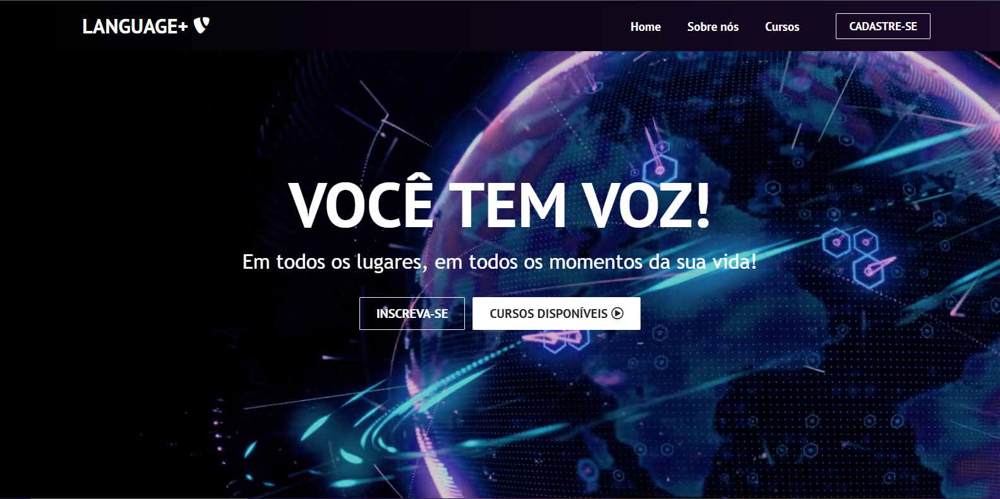
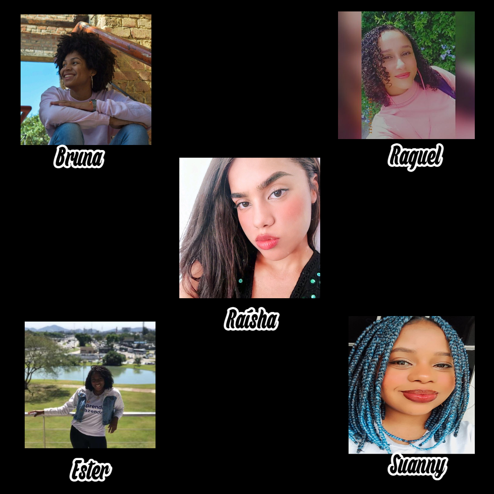

# Language+ 
 
### Escola/Curso de Idiomas

Projeto em squad, referente ao módulo 3, do curso de <strong>Desenvolvedor Web Full Stack</strong> do Resilia Educação, em parceria com o SENAC RJ.

O trabalho abaixo tem como o intuito estabelecer uma API REST utilizando JSON SERVER e explorando os protocólos de métodos HTTP. O repositório, trata-se dos dados de uma plataforma onde o usuário poderá contratar ou se inscrever em aulas/turmas de diversos idiomas. Além disso, nossa plataforma possui cursos direcionados para vários níveis - iniciante, avançado, empresarial/profissional e etc. Isso dá mais autonomia e variedade ao usuário e ele poderá escolhar qual nível e idioma deseja estudar! 

Para visualizá-lo, siga os passos abaixo:

## Clone este repositório através do GIT:

```sh
$ git clone https://github.com/brwnalima/JSON-SERVER
```

## Abra seu terminal ou prompt de comando, e instale o [ViteJS](https://vitejs.dev/) com o código abaixo:

```sh
cd language-plus
```

## Abra o repositório pelo terminal/prompt de comando

```sh
npm install
```

## Inicie o projeto

```sh
npm run dev
```

#### Caso não funcione, é necessário baixar as bibliotecas necessárias


<h1  align="center">Nossa página</h1>

<div align="center">
  
  


<h1  align="center">Quem somos?</h1>
<p align="center">Os cursos de idiomas da Language Plus são focados no seu objetivo!

Viagens

Se o seu desejo é viajar, conheça os lugares para onde pretende ir, aprenda sobre os pontos turísticos, vocabulário local, sobre transportes e hospedagem. Sinta-se seguro para estar em um novo lugar e aprender ainda mais sobre outras culturas!

Negócios & Tecnologia

Se o seu objetivo é melhorar o seu currículo e crescer na sua carreira, aprenda um novo idioma focando no seu desempenho profissional. Ter uma comunicação clara em um ambiente de negócios, desde o atendimento de ligações a respostas de e-mails, bem como na criação de relatórios e rotinas administrativas, saber uma língua estrangeira é fundamental para quem almeja uma carreira internacional ou trabalhar em uma empresa multinacional. Se você é um programador e precisa enriquecer seu vocabulário de inglês para programação, estudar conosco é opção perfeita para você. No nosso curso você aprenderá o vocabulário de forma prática e divertida para desenvolver e se desenvolver cada vez melhor!

Kids

Invista no futuro! Começando com a introdução aos fundamentos do idioma, vocabulários básicos e conversação do dia a dia, temas comuns como escola e esportes, expressões e frases simples, apresente sua criança a um mundo novo cheio de oportunidades! Com o avanço do curso seu(a) filho(a) aperfeiçoará ainda mais a pronúncia e sua autoconfiança!</p>


<h1 align="center">Nossas Devs</h1>
<div align="center">
  

  
[--Bruna Lima--](https://github.com/brwnalima) [--Ester Ramos--](https://github.com/EsterM99) [--Suanny Rodrigues--](https://github.com/suannyrodrigues) [--Raquel Sacramento--](https://github.com/devRaquel) [--Raísha Tinoco--](https://github.com/RayTdC).


<h3 align="center">Ferramentas utilizadas:</h3>

<div style="display: inline_block" align = "center"><br>

  
  
  
  
  
 
 
            
</div>

